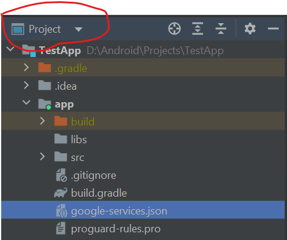
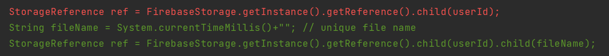

# TestApp
Contains basic code for Firebase authentication, realtime database, storage and Recyclerview

## Firebase connect
1) Create project in console(browser)
2. Create necessary services(`Authentication`,`Realtime Database`, `Storage` etc)
3. In android studio, go to `tools>firebase` and follow steps for connecting.

#### If you connect your project with `tools>firebase` before creating database or other things, You need to download the `google-services.json` file from `project-settings`(browser). Then replace the old one with new one. Old one can be found inside `app` folder in `Project` mode.

## Error

Red line is removed and Green lines are added. 
`Previously we were uploading file at same reference`, as a result instead of uploading a new file, it was replacing old one with new ones. 
`This is fixed by adding a unique fileName while uploading.`

#### Internet permission is required. It is added in manifest
